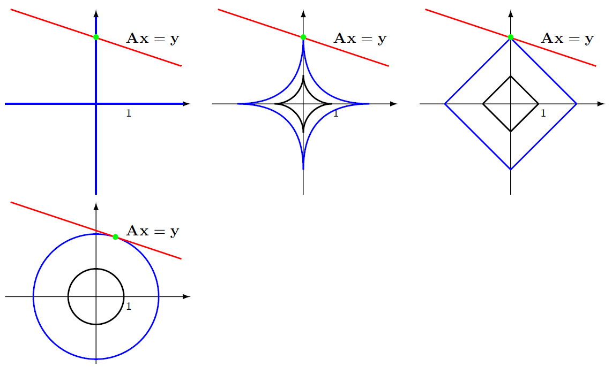

## Komprimované vzorkování

### Teoretické

1. Co je řídký signál a jak definujeme kritérium řídkosti? Co je oblast řídkosti signálu? Je každý signál v nějaké oblasti řídký?
2. Popište princip ztrátové komprese a rekonstrukce signálu v řídké oblasti. 
3. Použití adaptivních filtrů ve frekvenční oblasti: princip.
4. Komprimované vzorkování: princip.
5. Koherence bází: definice. Je pro komprimované vzorkování signálu lepší jsou-li měřící a řídká báze málo nebo hodně koherentní? Proč?
6. Co říká teorém o minimálním počtu vzorkům, které je třeba změřit, aby byla možná úplná rekonstrukce signálu? Jaké jsou funkční závislosti na délce signálu, řídkosti a koherenci bází?

----
1. Řídký signál je takový signál, který má většinu svých hodnot rovných nule nebo blízkých nule. Kritérium řídkosti je definováno jako počet nenulových koeficientů v dané bázi. Oblast řídkosti signálu je báze, ve které je signál řídký. Ne každý signál je v nějaké oblasti řídký.

2. Ztrátová komprese je proces, při kterém je signál transformován do řídké oblasti a jsou zachovány pouze nejdůležitější (největší) koeficienty. Při rekonstrukci se ztracené (malé) koeficienty nahradí nulami a signál se zpětně transformuje do původní oblasti. Tento proces může způsobit ztrátu informace, ale umožňuje výraznou redukci dat.

3. Adaptivní filtry ve frekvenční oblasti jsou používány pro zlepšení kvality signálu tím, že se přizpůsobují změnám ve frekvenčních charakteristikách signálu. Tento princip je založen na transformaci signálu do frekvenční oblasti, kde je filtr aplikován, a následné zpětné transformaci do časové oblasti.

4. Komprimované vzorkování je technika, která umožňuje rekonstrukci řídkých signálů z mnohem menšího počtu vzorků, než je požadováno Nyquistovým teorémem. Tato technika je založena na tom, že signál je řídký v nějaké transformační bázi a že měřící systém je málo koherentní s touto bází.

5. Koherence bází je míra, jak moc jsou si dvě báze podobné. Pro komprimované vzorkování je lepší, když jsou měřící a řídká báze málo koherentní. To je proto, že pokud jsou báze málo koherentní, je pravděpodobnější, že signál bude řídký v řídké bázi.
V kontextu komprimovaného vzorkování, které je založeno na řídkosti signálu, může být možné rekonstruovat signál z mnohem menšího počtu vzorků. Minimální počet vzorků v tomto případě závisí na řídkosti signálu a koherenci bází.

6. Funkční závislosti na délce signálu, řídkosti a koherenci bází jsou složité a mohou se lišit v závislosti na konkrétním algoritmu nebo metodě použité pro rekonstrukci signálu. Obecně platí, že čím řidší je signál a čím méně koherentní jsou báze, tím méně vzorků je potřeba pro rekonstrukci signálu. Délka signálu může také ovlivnit počet potřebných vzorků, ale tato závislost může být složitější a může záviset na konkrétních vlastnostech signálu a použité metody rekonstrukce.

----
## **Komprimované vzorkování**

**Nyquist-Shannonův vzorkovací teorém**

Nechť $x[n] = x(nT_s)$, a $ f_s \ge 2f_m$ 

kde $f_m$ je nejvyšší frekvence v $x(t)$. Potom

$
\begin{equation}
    \tag{Shannonova rekonstrukce}
    x(t) = \sum_{n=-\infty}^{+\infty} x[n] sinc(\frac{t - nT_s}{T_s})
\end{equation}
$

+ podmínka dokonalé rekonstrukce: Signál $x(t)$ má omezené spektrum
+ Zmírnění požadavku: $f_s \ge 2f_d$, kde $f_d$ je šířka pásma signálu

## **Řídké signály**
Vektorizovaný singál $\textbf{x} = (x[1], \dots, x(N))^T$

*k*-řídký signál má maximálně *k* nenulových hodnot

Definujeme takzvanou 0-normu vektoru, která je rovna počtu jeho nenulových hodnot. *k*-řídký signál splňuje

$
\begin{equation}
    \left\| x\right\|_0 \le k 
\end{equation}
$

Signál transformovaný do jiné oblasti (např. frekvenční pomocí DFT) již řídký být nemusí. Transformaci můžeme zapsat pomocí transformační matice

$
\begin{equation}
    \textbf{y} = \Psi^T\textbf{x}
\end{equation}
$

Vetšinou uvažujeme jen **ortogonální** transformace tj. které splňují

$
\begin{equation}
     \Psi\Psi^T = \textbf{I}
\end{equation}
$

například DFT.

**Příklady Řídkých signálů**

## **Komprese řídkého signálu**

Transformace $\textbf{x}$ do oblasti, ve které je řídký.

$
\begin{equation}
     \textbf{y} = \Psi^T \textbf{x}
\end{equation}
$
kde $\Psi$ musíme znát

Ukládáme pouze významné koeficienty $\textbf{y}$. Tedy ukládáme index koeficientu a jeho hodnotu. Například.

$
\begin{equation}
    y_S[k] = \left\{ \begin{array}{cl}
    y[k] & \left| y[k] \right| \gt \epsilon \\
    0  &   \left| y[k] \right| \le \epsilon
    \end{array} \right\}
\end{equation}
$

Použití i MPEG, JPEG, MP3 a další.

**Rekontrukce**

Platí

$
\begin{equation}
    \textbf{y} = \Psi^T\textbf{x} \quad \Leftrightarrow \quad \textbf{x} = \Psi^{-T}\textbf{y} = \Psi\textbf{y}
\end{equation}
 $

Komperese $\textbf{y}$ nahradíme $\textbf{y}_S$ (načteme z komprimovaného formátu)

Rekonstrukce: 

$
\begin{equation}
     \hat{\textbf{x}} = \Psi\textbf{y}_S
\end{equation}
$

Jelikož je $\Psi$ ortogonální, platí

$
\begin{equation}
     \left\| \hat{\textbf{x}} - \textbf{x} \right\|_2 = 
     \left\| \Psi\hat{\textbf{y}}_S - \Psi\textbf{y} \right\|_2 = 
     \left\| \Psi(\hat{\textbf{y}}_S - \textbf{y}) \right\|_2 = 
     \underbrace{\left\| \hat{\textbf{y}}_S - \textbf{y} \right\|_2}_{\text{malé}}
\end{equation}
$

kde $\left\| \cdot \right\|_2$ je euklidovská (tzv. $\ell_2$) norma 

$
\begin{equation}
    \left\| \textbf{x} \right\|_2 = \sqrt{\sum_{k=1}^{N}\left| x[k] \right|^2}     
\end{equation}
$

**Komprese + Rekonstrukce**

**Vzorkování v bázi $\phi$**

Formální popis vzorkování v bázi $\phi = (\varphi_1,\dots,\varphi_N)$

$
\begin{equation}
     y[k] = \varphi_k^T\textbf{x} = \left\langle \textbf{x},\varphi_k  \right\rangle
\end{equation}
$

Celý navzorkovaný signál

$
\begin{equation}
     \textbf{y} = \phi^T\textbf{x}
\end{equation}
$

Příklady
+ $\varphi_k(\ell) = \delta(\ell - k + 1)$ ("klasické" vzorkování v časové oblasti, $\phi = \textbf{I}$)
+ $\varphi_k(\ell) = e^{\frac{2\pi(\ell - 1)(k-1)}{N}}$ (vzorkování ve frekvenčním pásmu, \phi \equiv DFT)
+ $\varphi_k(\ell) \dots$ wavelety
+ $\varphi_k(\ell)$ náhodné $\dots$ noiselety

## **Komprimované vzorkování**

Vzorkujeme v bází $\phi$
$
\begin{equation}
     \textbf{y} = \phi^T\textbf{x}
\end{equation}
$

$\dots$ ale pouze $m$ koeficientů (rovnou komprimujeme) $m \le n$

$
\begin{equation}
     \phi \dots n \times m
\end{equation}
$

Předpoklad: $\textbf{x}$ je řídký v bázi $\Psi$ a naopak v bázi $\phi$ řídký není.

**Rekonstrukce**

Hledáme $\textbf{x}$, které splňuje

$
\begin{equation}
     \textbf{y} = \phi^T \textbf{x}
\end{equation}
$

Těch je ale nekonečně mnoho.

Hledáme proto takové $\textbf{x}$, kdy $\Psi^T \textbf{x}$ je co nejvíce řídké. Tedy

$
\begin{equation}
     \min \left\| \Psi^T \textbf{x}\right\| \quad \text{za podmínky} \quad \textbf{y} = \phi^T \textbf{x}
\end{equation}
$

Tuto úlohu však nelze vyřešit v polynomiálním čase (NP-úplný problém). Hladové algoritmy pro příbližná řešení: (Basic) Matching Pursuit, Orthogonal Matching Pursuit, $\dots$

**Řešení podle minimalizace $\left\| \cdot \right\|_1$**

$\ell_p$ norma

$$
\begin{equation}
    \tag{$\ell$ \text{norma}}
     \left\| \textbf{x} \right\|_p = \sqrt[p]{\sum_{i=1}^{N} \left| x[n] \right|^p}
\end{equation}
$$

$\ell_1$ norma

$$
\begin{equation}
    \tag{$\ell_1$ norma}
     \left\| \textbf{x} \right\|_1 = \sum_{i=1}^{N} \left| x[n] \right|
\end{equation}
$$

Řešíme
$$
\begin{equation}
     \min \left\| \Psi^T \textbf{x} \right\|_1 \quad \text{za podmínky} \quad \textbf{y} = \phi^T\textbf{x}
\end{equation}
$$

## **Proč je řešení s $\ell_1$ normou řídké?**

Naše úloha
$$
\begin{equation}
     \min \left\| \Psi^T \textbf{x} \right\|_1 \quad \text{za podmínky} \quad \textbf{y} = \phi^T\textbf{x}
\end{equation}
$$

Úloha lineárního programování

$$
\begin{equation}
     \underset{x}{\min} \textbf{ c}^T \textbf{x} \quad \text{za podmínky} \quad \textbf{Ax} = \textbf{b} \quad \text{a} \quad \textbf{x}_I \le \textbf{x} \le \textbf{x}_u
\end{equation}
$$

Řešení úlohy linéárního programování:
+ Existuje-li, leží ve vrcholu popřípadě celé stěně konvexního polyedru definovaného podmínkami.
+ Simplexový algoritmus, Dantzig 1951.

Úlohu lze přeformulovat na úlohu linéárního programování pomocí substituce $x = x_k - x_z$, kde $ x_k \ge 0$ a $x_z \ge 0$. Potom $ \left| x \right| = x_k + x_z$

## **Vztah bází $\phi$ a $\Psi$: Koherence**

Koherence báze $\phi$ a $\Psi$

$$
\begin{equation}
     \mu(\phi, \Psi) = \sqrt{N} \cdot \max\limits_{1 \le \text{$k$, $j$} \le N}
     \left|\left\langle \varphi_k,\psi_j \right\rangle \right|
\end{equation}
$$

Jsou-li $\phi$ a $\Psi$ ortogonální, platí

$$
\begin{equation}
     \mu(\phi, \Psi) \in \left[ 1, \sqrt{N} \right]
\end{equation}
$$

Říkáme, že $\phi$ a $\Psi$ jsou nekoherentní, je-li
$$
\begin{equation}
     \mu(\phi, \Psi) = 1
\end{equation}
$$

Příklady:
+ $\mu(\textbf{I}, \textbf{DFT}) = 1$, časová a frekvenční báze jsou nekoherentní
+ Koherence mezi noislets a waveletovými bázemi je $\sqrt{2}$ (Haar), 2.2(Daubechies D4), 2.9(Daubechies D8) a podobné.
+ Koherence náhodné báze s pevnou bází je s vysokou pravděpodobností rovna přibližně $\sqrt{2 \log(n)}$

**Jak velké musí být $m$?**

+ Čím menší je koherence bází $\phi$ a $\Psi$, tím může být $m$ menší
+ Logaritmická závislost na $N$.
+ Lineární závislost na $S$.
+ Je-li $\mu(\phi, \Psi) = 1$, potřebujeme řádově $S\log N$ vzorků.

## **Závěr**
+ Získávání užitečné informace ze signálu bez potřeby signálu "rozumět".
+ "Náhodné" vzorkování: signál je s vysokou pravděpodobností dokonale rekonstruován.
+ Možnost minimalizovat jiná kritéria než $\left\| \cdot \right\|_1$.
+ Robustní metody získávání zarušeného signálu.
+ Kódování, samoopravné kódy.
+ Vzorkování dat v bázi $\phi$, například snímání ve frekvenční oblasti (Magnetic Resonance Imaging - MRI)
+ A/I převodník, převod analogového signálu přímo na informaci, získávání dat může být "nákladné" - komprese již při vzorkování.