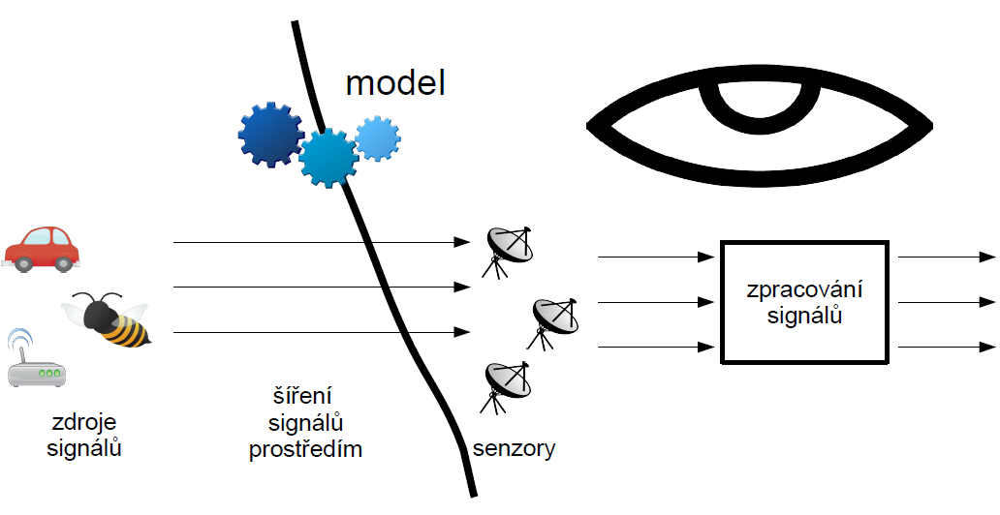
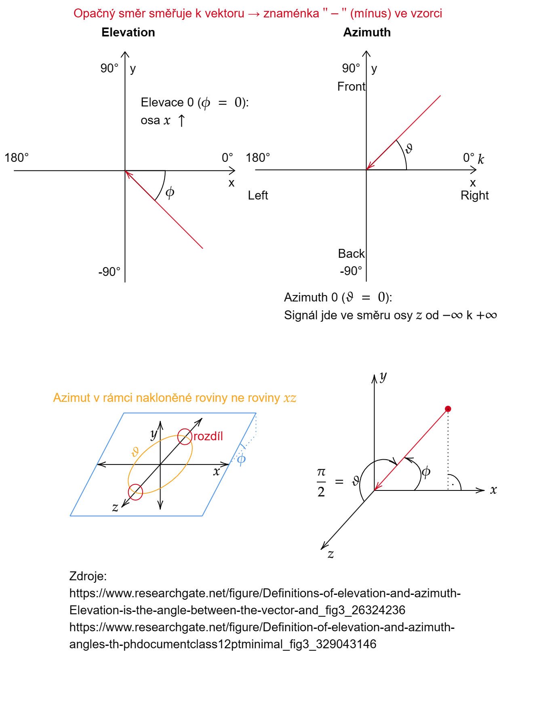
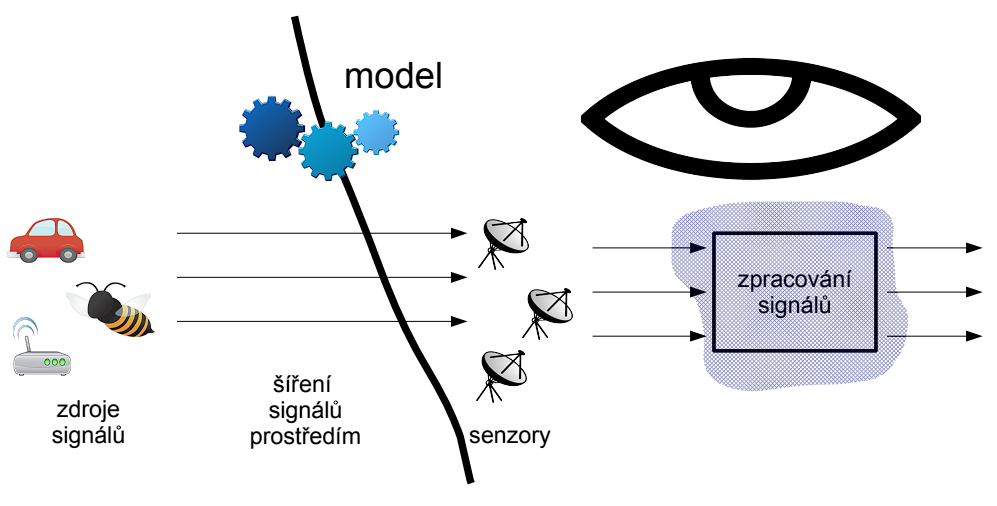
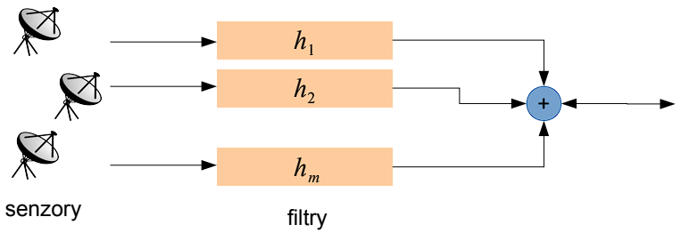
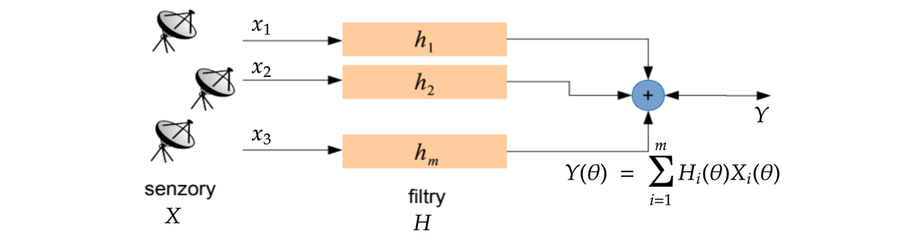
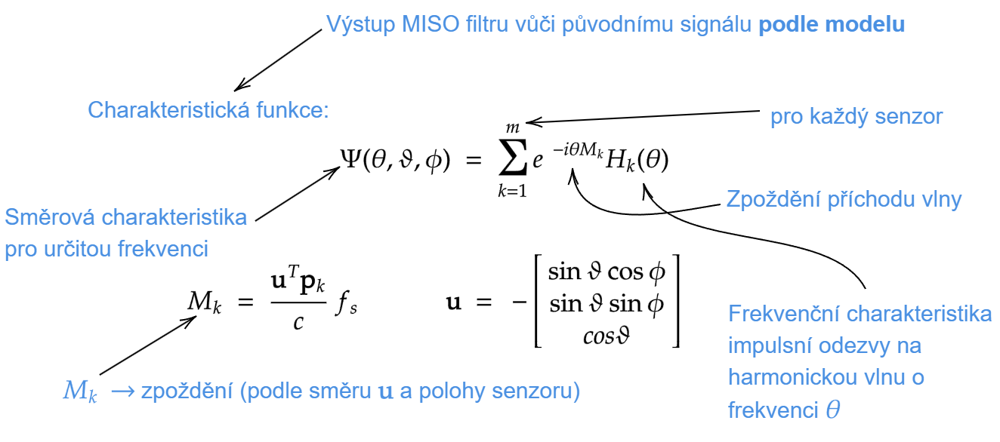
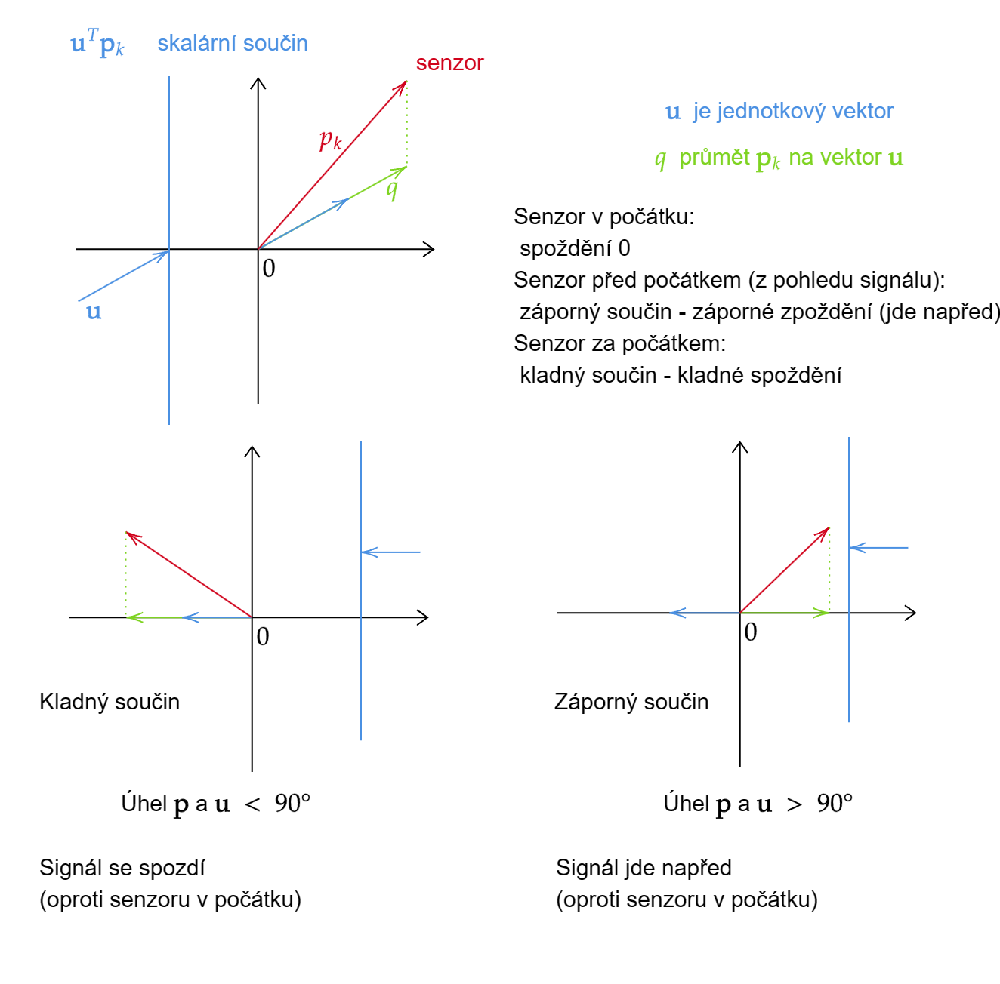
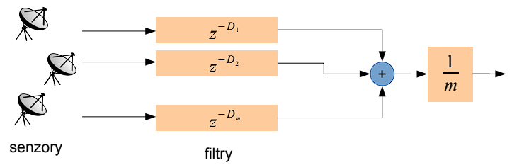

## Signály z více senzorů a jejich zpracování

### Teoretické

1. Lineární modely šíření signálů v prostoru: definice a účel a popis ve frekvenční oblasti.
2. Vícekanálový filtr: definice a popis v časové a frekvenční oblasti.
3. Přenosová funkce vícekanálového filtru v prostředí bez odrazů.
4. Delay-and-sum beamformer: definice a vlastnosti.
5. MVDR beamformer: definice a princip.
6. Optimální vícekanálový filtr ve smyslu kvadratické vzdálenosti: princip a definice.

----

## **Sígnály z více senzorů**

Šíření signálů

**Vícekanálové signály**

Použití více senzorů: signály pozorujeme neje v čase ale i v prostoru.

Předpokládáme $m$ senzorů.

$\textbf{p}_i$ nechť oznařuje polohu $i$ tého senzoru (vektor souřadnic)

Přepokládáme, že signály ze senzorů vzorkujeme synchronně.

Aplikace:
+ lokalizace zdroje
+ identifikace systému
+ separace signálů
+ zlepšování signálů
+ dekonvoluce (dereverberace)

**Signál z více senzorů - vektorový zápis**

Vzorek signálu (v časové oblasti)

$$
\begin{equation}
     \textbf{x}[n] = 
        \begin{bmatrix}
            x_1[n] \\
            \vdots \\
            x_m[n]
        \end{bmatrix}
\end{equation}
$$

kde $x_i[n]$ je vzorek signálu z $i$ tého senzoru, $m$ je počet senzorů.

Ve frekvenční oblasti

$$
\begin{equation}
     \textbf{X}[\theta] = 
        \begin{bmatrix}
            X_1[\theta] \\
            \vdots \\
            X_m[\theta]
        \end{bmatrix}
\end{equation}
$$

kde $\theta$ je frekvence.

## **Lineární modely šíření signálů**

+ Platí princip superpozice.

**Model bez zpoždění a odrazů**

Model předpokládá okamžité šíření signálů bez odrazů a aditivní šum

$$
\begin{equation}
     \textbf{x}[n] = \textbf{As}[n] + \textbf{v}[n]
\end{equation}
$$

+ $\textbf{s}[n]$ má $d$ složek, takzvané zdrojové nebo též "originální" signály $s_1[n],\dots,s_d[n]$.
+ $\textbf{A}$ je matice $m \times d$
+ $\textbf{v}[n]$ má rozměr jako $\textbf{x}[n]$ a obsahuje signály, které nazýváme šum.
+ ve frekvenční oblasti

$$
\begin{equation}
    \textbf{X}(\theta) = \textbf{AS}(\theta) + \textbf{V}[\theta]     
\end{equation}
$$

**Příklad: EEG a EKG záznamy**

+ Typický vzorkovací frekvence je do 2kHz.
+ Rychlost šíření signálu: rychlost světla.
+ Odrazy a zpoždění tedy můžeme zanedbat a modelovat signály pomocí okamžitého modelu.
    + (pozn.) Projevuje se pouze útlum a signály z různých zdrojů se míchají
+ Neznáme ovšem přesné skutečnosti o signálech $\textbf{s}[n]$

**Příklad: jeden signál** $s_1[n]$

Nechť $d = 1$, tedy pozorujeme jen jeden signál.

$\textbf{A}$ má pouze jeden sloupec, který značíme $\textbf{a}$ (steering vector)

Platí

$$
\begin{equation}
    \textbf{x}[n] = \textbf{a}s[n] + \textbf{v}[n]
\end{equation}
$$

ve frekvenční oblasti

$$
\begin{equation}
    \textbf{X}(\theta) = \textbf{a}S(\theta) + \textbf{V}(\theta)
\end{equation}
$$

+ **zde je $\textbf{a}$ nezávislé na $\theta$**

## **Model s jedním zpožděným signálem bez odrazů**

Model zpožděného signálu s aditivním šumem 

(pozn.) v časové oblasti nelze zapsat vektorově

$$
\begin{equation}
     x_i[n] = a_is[n-D_i] + v_i[n]
\end{equation}
$$

tedy $D_i$ je zpozdění signálu $s[n]$ na $i$ tém senzoru.

Tento model jodpovídá signálu $s[n]$, které se šíří ideálním prostředním konečnou rychlostí a bez odrazů.

Šíří-li se signál jako rovinna vlna, zpoždění $D_i$ jsou funkcí směru šíření:

$$
\begin{equation}
     D_i = \frac{\textbf{u}^T\textbf{p}_i}{c} + \text{const}.
\end{equation}
$$

kde $\textbf{u} = \left[-\sin \vartheta \cos \phi, -\sin \vartheta \sin \phi, -\cos \vartheta \ \right]^T$ je jednotkový směrový vektor určený azimutem $\vartheta$ a elevací $\phi$ a $c$ je rychlost šíření signálu.

(pozn. vytvořil @Martin Motejlek) Pomocí img k pochopení úhlů ve vzorci  $\textbf{u} = \left[-\sin \vartheta \cos \phi, -\sin \vartheta \sin \phi, -\cos \vartheta \ \right]^T$

**Popis ve frekvenční oblasti**

Ve frekvenční oblasti

$$
\begin{equation}
     X_i(\theta) = a_i e^{-i \theta D_i} S(\theta) + V_i(\theta)
\end{equation}
$$

Vektorový zápis

$$
\begin{equation}
     X(\theta) = b(\theta) S(\theta) + V(\theta)
\end{equation}
$$

kde 

$$
\begin{equation}
     \textbf{b}[\theta] = 
        \begin{bmatrix}
            a_1 e^{-i\theta D_1} \\
            \vdots \\
            a_m e^{-i\theta D_m}
        \end{bmatrix}
\end{equation}
$$

Vektor $\textbf{b}$ je závislý na $\theta$

## **Model zpožděného signálu: příklady**

+ Odhad směru příchodu signálu
+ Lokalizace
+ Radar, sonar $\dots$

## **Konvolutorní model: s odrazy**

Kovolutorní model s aditivním šumem

$$
     x_i[n] = \sum_{k=1}^{d} \lbrace a_{i, k} \ast s_k \rbrace[n] + v_i[n]   
$$

Jinými slovy $k$ tý signál doputuje na $i$ tý senzor zfiltrovaný filtrem $a_{i,k}$ (odrazy, zpoždění, atp.)

Ve frekvenční oblasti

$$
\begin{equation}
     X_i(\theta) = \sum_{k=1}^{d}  A_{i, k}(\theta) S_k(\theta) + V_i(\theta)
\end{equation}
$$

Vektorový zápis

$$
\begin{equation}
    \textbf{X}(\theta) =  \textbf{A}_{i, k}(\theta) \textbf{S}(\theta) + \textbf{V}(\theta)
\end{equation}
$$

kde $\textbf{A}(\theta)$ je matice jejíž $ik$ tý prvek je $A_{i,k}(\theta)$

Váhoda popisu ve frekvenční oblasti: soustava nezávislých modelů (pro každou frekvenci jeden)

## **Konvolutorní vs. model bez odrazů a zpoždění**

Model bez odrazů a zpoždění ve frekvenční oblasti

$$
\begin{equation}
    \textbf{X}(\theta) =  \textbf{AS}(\theta) + \textbf{V}(\theta)
\end{equation}
$$

Konvolutorní model ve frekvenční oblasti

$$
\begin{equation}
    \textbf{X}(\theta) =  \textbf{A}(\theta) \textbf{S}(\theta) + \textbf{V}(\theta)
\end{equation}
$$

+ Rozdíl: $\textbf{A}$ je/není závislá na frekvenci $\theta$

Příkladem konvolutorního modelu jsou akustické záznamy.

## **Zpracování vícekanálových záznamů filtry**

**MISO filtr (Multi-input single-output)**

Nazýváme též *Filter-and-sum beamformer*

(pozn.) Beamformer je vícekanálový filtr

Výstupem je 

$$
\begin{equation}
     y[n] = h_1 \ast x_1[n] + \dots + h_m \ast x_m[n]
\end{equation}
$$

**MISO filtr (Multi-input single-output)**

+ Je to LTI systém.
+ Srovnejte se situací, kdy máme jen jeden senzor:
    + Pozorujeme na něm právě jeden signál $x[n]$ a můžeme se rovnou ptát co s ním provede zpracování filtrem.
+ Máme-li více senzorů záleží nejde na filtrech $h_1, \dots, h_m$, ale i na tom jaké jsou souvislosti mezi signály, které pozorujeme na senzorech.
+ (pozn.) Filtr může těchto souvistlostí využívat, aby byl získán požadovaný výstup.
+ Jinými slovy: 
    + Charakteristiku MISO filtru je nutno definovat spolu s předpokládaným modelem signálu
    + (pozn.) K charakteristice je nutno uvést, jaký je předpokládaný model.
    + (pozn.) Navržený filtr předpokládá určitý model signálu, aby správně fungoval

**MISO filtr**

Výstup v časové oblasti

$$
\begin{equation}
     y[n] = \sum_{i=1}^{m}\left\lbrace h_i \ast x_i \right\rbrace[n]
\end{equation}
$$

(pozn.) $m =$ počet senzorů

ve frekvenční oblasti

$$
\begin{equation}
     Y(\theta) = \sum_{i=1}^{m} H_i(\theta)X_i(\theta)
\end{equation}
$$

a vektorově

$$
\begin{equation}
     \textbf{Y}(\theta) = \textbf{H}(\theta)^T \textbf{X}(\theta)
\end{equation}
$$

kde $\textbf{H}(\theta) = \left\[ H_1(\theta), \dots, H_m(\theta) \right\]^T$

## **Charakteristika MISO filtru**

Předpoklad:
+ signál je rovinná harmonická vlna o frekvenci $\theta$ přicházející z nekonečna ve směru normálového vektoru $\textbf{u}$ rychlostí $c$ m/s a šíří se bez odrazů.

(pozn.)

Původní signál na každý vstup dochází se spožděním $e^{-i\theta M_k}$

Signál z každého vstupu je zpracován filtrem $H_k(\theta)$

Pak se všechny výstupu sečtou $\rightarrow$ výstup MISO filtru

$\Psi$ zahrnuje všechny tyto kroky oddělující původní signál od výsledného

**Příklad: Dealy-and-sum beamformer**

+ Signál na $k$ tém senzoru je zpožděn o $D_k$ vzorků.
+ Tedy $h_k[n] = \frac{1}{m} \delta [n + D_k]$ , $H_k(\theta) = \frac{1}{n} e^{e \theta D_k}$
+ Charakteristická funkce:

$$
\begin{equation}
      \Psi(\theta, \vartheta, \phi) = \frac{1}{m} \sum_{k=1}^{m} e^{-i \theta M_k} e^{i \theta D_k} = \frac{1}{m} \sum_{k=1}^{m} e^{i \theta (D_k - M_k)}
\end{equation}
$$

(pozn.)
+ $D_k$ je kompenzace spoždění
+ Původní signál je na vstupu zpožděn o $M_k$ , filtrem je kompenzováno zpoždění $D_k$
+ $D_k = M_k$ ; výsledek je synchronizovaný průměr $\rightarrow$ aproximace původního signálu. Synchronizovaný průměr navíc odstraňuje šum.
+ (Ideálně) je původní signál po průchodu filtrem nezměněn $\rightarrow \Psi(\theta,\vartheta,\phi)=1$ 

+ 
+ Signál může přicházet i z ostatních směrů!
+ Směrová charakteristika - směry, ze kterých nejsou signály v součtu synchronizovány, podlehnou zkreslení (interference v součtu) **a jejich magnituda je zeslabena**
+ Nastavením směrové charakteristiky lze filtrovat signál podle směru příchodu
     + Fyzické rozmístění a charakteristiky senzorů - software
+ Delay-and-sum beamforme ji umožňuje měnit softwarově.
+ **Směrová charakteristiky závisí na frekvenci**

## **Charakteristika MISO filtru v reálném prostředí**

Výše definovaná charakteristika předpokládá ideální prostředí a opomíjí skutečnou polohu zdroje.

Odezva MISO filtru v reálném prostředí na signál $s[n]$ je

$$
\begin{equation}
      \Psi(\theta) = \sum_{k=1}^{m} F_k(\theta) H_k(\theta)
\end{equation}
$$

kde $F_k(\theta)$ je frekvenční charakteristika impulzní odezvy prostředí mezi zdrojem signálu $s[n]$ a $k$ tým senzorem.

(pozn.) $F_k(\theta)$ započítává odrazy.

Navíc bychom mohli započítat i frekvenční a směrovou charakteristiku senzorů.

(pozn.) Charakteristika: zmena magnitudy a fáze (v určité závislosti)

## **Optimální vícekanálové filtry**

**MISO filtr délky 1**

Výstupem je lineární kombinace signálů ze senzorů

$$
\begin{equation}
      y[n] = w_1 x_1[n] + \dots + w_m x_m[n] = \textbf{w}^T\textbf{x}[n]
\end{equation}
$$

Příklad: pozorujeme jeden ze signálů šířící se bez zpoždění a odrazů. Pak je výsledek zpracování

$$
\begin{equation}
      y[n] = \textbf{w}^T \textbf{x}[n] = \textbf{w}^T \textbf{a}s[n] + \textbf{w}^T \textbf{v}[n]
\end{equation}
$$

SNR výstupu je 

$$
\begin{equation}
      \frac{(\textbf{w}^T \textbf{a})^2 E[s[n]]^2}{\textbf{w}^T E[\textbf{v}[n] \textbf{v}[n]^T]\textbf{w}}
\end{equation}
$$

Definujeme kovariační matici šumu: 

$$
\begin{equation}
      \tag{Kovariační matice šumu}
      \textbf{C} = E[\textbf{v}[n] \textbf{v}[n]^T]
\end{equation}
$$

(pozn.) jmenovatel je $\textbf{w}^T \textbf{C} \textbf{w}$ minimalizace jmenovatele $\rightarrow$ minimalizace šumu.

## **Minimum Variance Distortionless (MVDR) beamformer**

Chceme minimální energii šumu na výstupu a zároveň zachovat původní intenzitu signálu. Tedy

$$
\begin{equation}
      \textbf{w} = \arg \min_\textbf{w} \textbf{w}^T \textbf{Cw} \quad \text{w.r.t.} \quad \textbf{w}^T\textbf{a} = 1
\end{equation}
$$

kde $\textbf{C}$ je kovarianční matice šumu

Řešením je 

$$
\begin{equation}
      \textbf{w} = \frac{1}{\textbf{a}^T \textbf{C}^{-1} \textbf{a}}\textbf{C}^{-1}\textbf{a}
\end{equation}
$$

Je-li $\textbf{C} = \sigma^2 \textbf{I}$ , pak

(pozn.) šum na vstupech nezkresluje - izotropní šum je nesměrový.

$$
\begin{equation}
      \textbf{w} = \frac{\textbf{a}}{\left\| \textbf{a} \right\|^2}
\end{equation}
$$

**MISO filtr délky $L$ : Vektorový zápis v časové oblasti**

Vektorový zápis MISO FIR filtr délky $L$

$$
\begin{equation}
     \tilde{\textbf{x}}[n] = 
     \begin{bmatrix}
          x_1[n]\\ 
          \vdots\\
          x_1[n-L+1]\\
          x_2[n]\\
          \vdots\\
          \vdots\\
          x_m[n-L+1]
     \end{bmatrix}
     \quad
     \textbf{h} = 
     \begin{bmatrix}
          h_1[n]\\ 
          \vdots\\
          h_1[L]\\
          h_2[n]\\
          \vdots\\
          \vdots\\
          h_m[L]
     \end{bmatrix}
\end{equation}
$$

Platí $y[n] = \textbf{h}^T\tilde{\textbf{x}}[n]$

**Vektorový zápis zpracování celého záznamu**

$$
\begin{equation}
      \textbf{X} = 
      \begin{bmatrix}
          x_1[n]    &    \dots     &    \dots     &    x_1[N]    \\
          0         &    x_1[1]    &    \dots     &    x_1[N-1]  \\
          \vdots    &    \vdots    &    \ddots    &    \vdots    \\
          0         &    0         &    \dots     &    x_1[N-L+1]\\
          x_2[n]    &    \dots     &    \dots     &    x_2[N]    \\
          0         &    x_2[1]    &    \dots     &    x_2[N-1]  \\
          \vdots    &    \vdots    &    \ddots    &    \vdots    \\
          0         &    0         &    \dots     &    x_m[N-L+1]
     \end{bmatrix}
     =
     \begin{bmatrix}
          \tilde{\textbf{x}}[1]    &    \dots     &    \tilde{\textbf{x}}[N]
     \end{bmatrix}
\end{equation}
$$

Řádkový vektor $\textbf{y}$ obsahující všechny vzorky $y[n]$ můžeme zapsat jako

$$
\begin{equation}
      \textbf{y} = \textbf{h}^T \textbf{X}
\end{equation}
$$

pro $m = 1$ je značení shodné s předchozími přednáškami. 

## **Optimální vícekanálový LMS filtr

Nechť