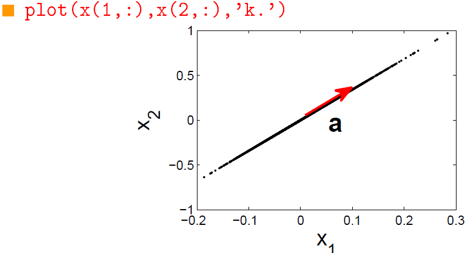
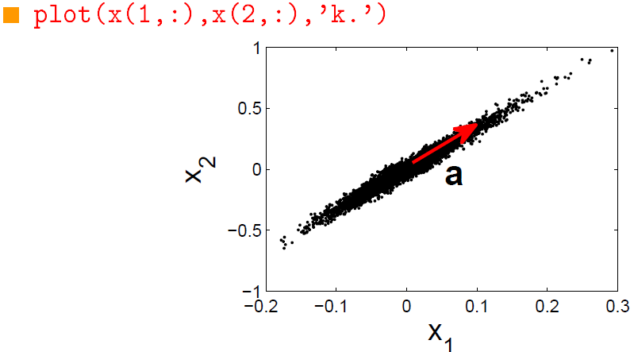
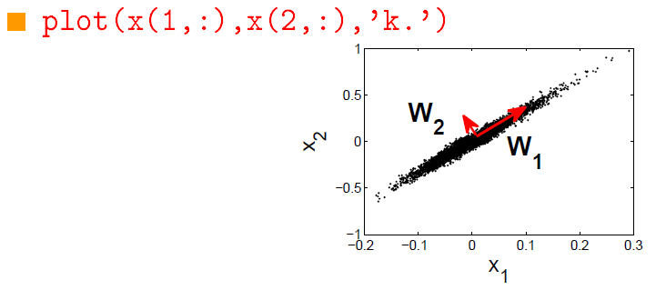

## Analýza hlavních komponent

### Teoretické

1. Komponenta vícekanálového signálu: definice, rozptyl komponenty a souvislost s kovarianční maticí vícekanálového signálu.
2. Směrový vektor signálu: definice.
3. Hlavní komponenty vícekanálového signálu: definice a výpočet.
4. Vlastnosti hlavních komponent vícekanálového signálu.
5. Redukce dimenze vícekanálového signálu pomocí PCA: princip a postup.

----

1. Komponenta vícekanálového signálu je jedna z mnoha částí, které tvoří celkový signál. Každý kanál představuje jednu komponentu signálu. Rozptyl komponenty je míra variability hodnot komponenty. Kovarianční matice vícekanálového signálu je matice, která obsahuje kovariance mezi jednotlivými páry komponent. Kovariance je míra, jak se dvě proměnné mění společně. Diagonální prvky kovarianční matice představují rozptyly jednotlivých komponent.

2. Směrový vektor signálu je vektor, který určuje směr signálu v prostoru. V kontextu vícekanálových signálů, směrový vektor může být použit k popisu směru, ve kterém se signál šíří nebo se mění.

3. Hlavní komponenty vícekanálového signálu jsou nové proměnné, které jsou lineární kombinací původních proměnných (komponent). Tyto nové proměnné jsou navrženy tak, aby zachovaly co nejvíce variability původních dat. Výpočet hlavních komponent se obvykle provádí pomocí metody PCA, která zahrnuje výpočet vlastních vektorů a vlastních hodnot kovarianční matice dat.

4. Hlavní komponenty jsou nekorelované, což znamená, že nemají žádnou lineární závislost mezi sebou. První hlavní komponenta zachycuje co nejvíce variability dat a každá další hlavní komponenta zachycuje co nejvíce zbytkové variability.

5. Princip PCA spočívá v transformaci původních proměnných do nového souřadnicového systému, kde jsou osy tohoto systému hlavní komponenty. Tento proces umožňuje zachovat co nejvíce informací (variability) z původních dat v menším počtu dimenzí, což může být užitečné pro vizualizaci, analýzu a zpracování dat.
Postup redukce dimenze pomocí PCA je následující:
     + **Standardizace dat:** Data jsou standardizována tak, aby měla každá proměnná (komponenta) průměr 0 a směrodatnou odchylku 1. Tento krok je důležitý, protože PCA je citlivý na měřítko proměnných.
     + **Výpočet kovarianční matice:** Kovarianční matice je vypočítána z dat. Tato matice obsahuje kovariance mezi všemi páry proměnných.
     + **Výpočet vlastních vektorů a vlastních hodnot kovarianční matice:** Vlastní vektory a vlastní hodnoty kovarianční matice jsou vypočítány. Vlastní vektory představují směry hlavních komponent, zatímco vlastní hodnoty představují množství variability, které každá hlavní komponenta zachycuje.
     + **Vytvoření nových proměnných (hlavních komponent):** Hlavní komponenty jsou vytvořeny aplikací vlastních vektorů na původní data. Tyto nové proměnné jsou nekorelované a zachycují co nejvíce variability původních dat.
     + **Výběr hlavních komponent:** Na základě potřeb analýzy můžeme vybrat počet hlavních komponent, které chceme ponechat. Obvykle se vybírají ty hlavní komponenty, které zachycují významnou část celkové variability dat.

----
## **Analýza hlavních komponent (PCA)**

Signál $s[n]$ je snímaný dvěma senzory (bez spoždění a odrazů).

$$
\begin{equation}
    \tag{Model}
     \textbf{x}[n] = \textbf{a}s[n]
\end{equation}
$$

kde 

$$
\begin{equation}
     \textbf{a} = \begin{pmatrix}
        a_1 \\
        a_2
     \end{pmatrix}
\end{equation}
$$

Stejný signál s aditivním šumem

$$
\begin{equation}
     \textbf{x}[n] = \textbf{a}s[n] + \textbf{v}[n]
\end{equation}
$$

**Připomenutí MVDR beamformer**

Výstup filtru $\textbf{w}$

$$
\begin{equation}
     y[n] = \textbf{w}^T\textbf{x}[n] = \textbf{w}^T \textbf{a}s[n] + \textbf{w}^T\textbf{v}[n]
\end{equation}
$$

MVDR beamformer minimalizuje energii šumu na výstupu, tj. $\left\| \textbf{w}^T\textbf{v}[n] \right\|^2$, za podmínky $\textbf{w}^T\textbf{a} = 1$

$$
\begin{equation}
     \textbf{w} = \arg \min_{\textbf{w}} \textbf{w}^T\textbf{C}_\text{v} \textbf{w} \quad w.r.t. \quad \textbf{w}^T\textbf{a}=1
\end{equation}
$$

kde $\textbf{C}_v = E[\textbf{v}[n]\textbf{v}[n]^T]$ je kovariační matice šumu.

V našem příkladu $ \textbf{C}_v = \sigma_v^2\textbf{I}$ (viz. [6 přednáška](6T1.md)), pak

$$
\begin{equation}
     \textbf{w} = \frac{\textbf{a}}{\left\|\textbf{a} \right\|^2} \Longrightarrow y[n] = s[n] + \frac{\textbf{a}^T}{\left\| \textbf{a} \right\|^2}\textbf{v}[n] 
\end{equation}
$$

**Příklad 2 - SNR pro případ $\textbf{C}_\text{v} = \sigma_\text{v}^2\textbf{I}$**

Označíme 
$$
\begin{equation}
     E[s[n]]^2 = \sigma_s^2 \qquad \text{a} \qquad E[v_i[n]]^2 = \sigma_\text{v}^2
\end{equation}
$$

SNR na $i$ tém senzoru je 

$$
\begin{equation}
     \text{SNR}_i = \frac{a_i^2\sigma_s^2}{\sigma_\text{v}^2}
\end{equation}
$$

SNR výstupu MVDR beamformeru je 

$$
\begin{equation}
     \text{SNR}_y = \frac{\sigma_s^2}{\sigma_\text{v}^2} = \frac{1}{\left\| \textbf{a} \right\|^2}(\text{SNR}_1 + \text{SNR}_2)
\end{equation}
$$

Co když $\textbf{a}$ neznáme?

**Příklad 2 - První hlavní komponenta**

První hlavní komponentu definujeme skrze

$$
\begin{equation}
     \textbf{w}_1 = \arg \max_{\left\| \textbf{W} \right\| = 1} \left\| \textbf{w}^T \textbf{x} \right\|^2 = \arg \max_{\left\| \textbf{W} \right\| = 1} \textbf{w}^T \textbf{C}_x \textbf{w}
\end{equation}
$$

kde $\textbf{C}_x = E[\textbf{x}[n] \textbf{x}[n]^T]$ je kovariační matice signálů

Řešením je vlastní vektor $\textbf{C}_x$ příslušející největšímu vlastnímu číslu.

V tomto příkladu

$$
\begin{equation}
     \textbf{C}_x = \sigma_s^2 \textbf{aa}^T + \sigma_\text{v}^2 \textbf{I}
\end{equation}
$$

Pokud by $\sigma_\text{v}^2 = 0$, pak

$$
\begin{equation}
     \textbf{w}_1 = \frac{\textbf{a}}{ \left\| \textbf{a} \right\|^2}
\end{equation}
$$

**Příklad 2 - Druhá hlavní komponenta**

Druhou hlavní komponentu definujeme

$$
\begin{equation}
     \textbf{w}_2 = \arg \max_{\left\| \textbf{W} \right\| = 1} \textbf{w}^T \textbf{C}_x \textbf{w}
\end{equation}
$$

za podmínky $\textbf{w}_2^T \textbf{w}_1 = 0$

Řešením je vlastní vektor $C_x$ příslušející druhému největšímu vlastnímu číslu.

Pokud $\sigma_\text{v}^2 = 0$, pak $\textbf{w}_1 = \frac{\textbf{a}}{\left\| \textbf{a} \right\|^2}$ a podmínka $\textbf{w}_2^T \textbf{a} = 0$ znamená, že druhá komponenta neobsahuje signál $s[n]$

## **Analýza hlavních komponent - PCA**

Formální definice: Hlavní komponenty vícerozměrného signálu $\textbf{x}[n]$ jsou

$$
\begin{equation}
     \textbf{z}[n] = \textbf{V}^T \textbf{x}[n]
\end{equation}
$$

kde sloupce $\textbf{V}$ jsou normované vlastní vektory matice

$$
\begin{equation}
     \textbf{C}_x = E[\textbf{x}\textbf{x}^T]
\end{equation}
$$

a seřazené podle velikosti příslušných vlastních čísel.

## **Vlastnosti PCA**

$\textbf{C}_x$ je symetrická a positivně semidefinitní $\Longrightarrow$ vlastní čísla jsou reálná a nezáporná a vlastní vektory jsou na sebe kolmé.

To znamá, že 

$$
\begin{equation}
     \textbf{VV}^T = \textbf{I}
\end{equation}
$$

**PCA pomocí SVD**

Označme $\textbf{X}$ matici, jejíž $n$ tý sloupec je $\textbf{x}[n]$

SVD - Singular Value Decomposition (pozn.) [SVD - Buxton](https://www.youtube.com/watch?v=gXbThCXjZFM)

Rozklad

$$
\begin{equation}
     \textbf{X} = \textbf{H}\Sigma \textbf{G}^T
\end{equation}
$$

kde $\textbf{H}$ a $\textbf{G}$ jsou ortogonální matice a $\Sigma$ je diagonální.

Sloupce $\textbf{H}$ jsou vlastní vektory matice $\textbf{C}_x$

Diagonální prvky $\Sigma$ jsou singulární čísla $\textbf{X}$ a jsou rovny odmocninám vlastních čísel $\textbf{C}_x$

Řádky matice $\Sigma \textbf{G}^T$ jsou hlavní komponenty.

## **Dekompozice a rekonstrukce signálů pomocí PCA**

1. Nechť $\textbf{X}$ značí signály (v řádcích)
2. Spočítáme matici vlastních vektorů $\textbf{V}$ kovarianční matice $\textbf{X}$ pomocí *eig*
3. Spočítáme hlavní komponenty (dekompozice)

$$
\begin{equation}
    \textbf{Z} = \textbf{V}^H \textbf{X}     
\end{equation}
$$

4. Určíme které komponenty (ne)chceme. Nežádoucí komponenty vynulujeme nebo nějak zpracujeme. Změněná data označíme $\tilde{\textbf{Z}}$.
5. Rekonstruujeme původní data

$$
\begin{equation}
     \tilde{\textbf{X}} = \textbf{V} \tilde{\textbf{Z}}
\end{equation}
$$

Kontrola: Pokud v rámci kroku 4 neprovedeme žádné změny, výsledkem jsou původní data, tedy $\tilde{\textbf{X}} = \textbf{X}$

## **Redukce dimenze pomocí PCA**

1. Spočítáme hlavní komponenty (dekompozice); nechť jsou uspořádané od největší po nejměnší.

$$
\begin{equation}
     \textbf{Z} = \textbf{V}^H \textbf{X}
\end{equation}
$$

2. Určíme kolik hlavních komponent zachováváme. Označme jejich počet $R$
3. Redukujeme dimenzi dat: $\textbf{Z}_{\text{red}} = \textbf{Z}_{1:R,:}$ , což je stejné  jako $\textbf{V}_{\text{red}} = \textbf{V}_{:,1:R}$ a $\textbf{Z}_{\text{red}} = \textbf{V}_{\text{red}}^H \textbf{X}$
4. Rekonstruovaná (redukovaná) data jsou rovna 

$$
\begin{equation}
     \textbf{X}_\text{red} = \textbf{V}_\text{red} \textbf{Z}_\text{red}
\end{equation}
$$

Platí: $\textbf{X}_\text{red}$ jsou nejlepší aproximací $\textbf{X}$ o dimenzi $R$ ve smyslu kvadratické vzdálenosti, tj. $\left\| \textbf{X} - \textbf{X}_\text{red} \right\|^2_F$

**Aplikace**

+ Určení podprostoru, který obsahuje šum (Noise Subspace)
+ Redukce dimenze dat
+ Příklady: EKG, MFCC, $\dots$