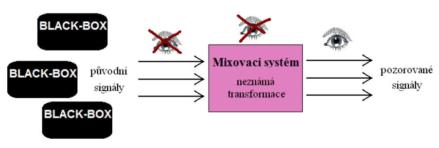
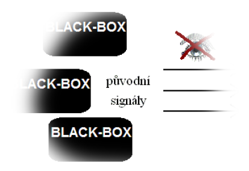

## Slepá separace signálů

### Teoretické

1. Definice úlohy slepé separace signálů; okamžitý model míšení signálů; přeurčený, určený a nedourčený model.
2. Princip analýzy nezávislých komponent, nejednoznačnost řešení.
3. Vzájemná informace: definice a vlastnosti.

----

## **Úloha slepé separace signálů**

Pozorované signály jsou neznámou směsí neznámých původních signálů

Úlohou slepé separace (BSS) je získání původních signálů

Slepá identifikace spočívá v odhadu parametrů systému, který signály míchal.

## **Lineární modely směsí**

Lineární model bez odrazů a zpoždění:

$$
\begin{equation}
     \textbf{X} = \textbf{AS}
\end{equation}
$$

Konvolutorní model

$$
\begin{equation}
     x_i(t) = \sum_{j=1}^{d} \sum_{\tau = 0}^{+\infty}a_{ij}(\tau)s_j(t-\tau)
\end{equation}
$$

+ $\textbf{S}$ , $s_j(t)$ - původní signály, $j = 1,\dots, d$
+ $\textbf{X}$ , $x_i(t)$ - pozorované směsi signálů, $i = 1,\dots, m$
+ $\textbf{A}$ - mixovací matice $m \times d$

**Počet signálů $d$ vs. počet senzorů $m$**

$$
\begin{equation}
    \begin{split}
    m \gt d    & \quad \text{Přeurčený systém lze redukovat na určený } m = d \text{, smysl má spíše je-li uvažován aditivní šum } \textbf{X} = \textbf{AS} + \textbf{N} \\
    m = d      & \quad \text{Úlohy hledání } \textbf{A} \text{ nebo } \textbf{S} \text{ nebo } \textbf{A}^{-1} \text{ jsou ekvivalentní.} \\
               & \quad \text{Tedy} \quad \textbf{X} = \textbf{AS} \quad \textbf{S} = \textbf{A}^{-1}\textbf{X} \\
    m \lt d    & \quad \text{Nedourčený systém, úlohy separace a identifikace jsou odlišné.}
    \end{split}
\end{equation}
$$

## **Metody slepé separace**

Předpoklady o původních signálech $\textbf{S}$
+ $\textbf{S}$ jsou nezáporné: Rozklad $\textbf{X}$ na nezáporné matice, NMF, NTD
+ $\textbf{S}$ jsou řídké: Rozklad $\textbf{X}$ takový, aby $\textbf{S}$ byly co nejvíce řídké (SCA)
+ $\textbf{S}$ jsou *nezávislé*: Analýza nezávislých komponent (ICA)

## **Analýza nezávislých komponent**

Lineární model bez odrazů a zpoždění:

$$
\begin{equation}
     \textbf{X} = \textbf{AS}
\end{equation}
$$

Počet původních signálů je stejný jako počet signálů měřených $m = d$. Matice $\textbf{A}$ je čtvercová matice $m \times m$

Hledáme $\textbf{A}$ nebo rovnou její inverzi $\textbf{A}^{-1}$. Odhadovanou matici označíme $\textbf{W}$. Ideálně chceme, aby 

$$
\begin{equation}
     \textbf{WX} \approx \textbf{S}
\end{equation}
$$

Hledáme matici $\textbf{W}$ takovou, aby $\textbf{WX}$ byly nezávislé.

**Nejednoznačnost řešení**

Řešení není jednoznačné: Můžeme změnit pořadí a škálu signálů $\textbf{S}$ a zůstanou nezávislé.

$\textbf{W}$ je řešení kdykoliv platí 

$$
\begin{equation}
     \textbf{WA} = \textbf{PD}
\end{equation}
$$

kde $\textbf{P}$ je permutační matice (změna pořadí signálů) a $\textbf{D}$ je diagonální (mění škálu signálů).

Je-li řešení až na tyto vyjímky jednoznačné, říkáme, že je *v podstatě jednoznačné* (essentialy unique)

**Předzpracování pomocí PCA**

Obecně platí: jsou-li signály nezávislé, pak jsou i nekorelované.

Můžeme tedy signály $\textbf{X}$ nejprve transformovat tak, aby byly nekorelované, čímž splníme nutnou (nikoliv však postačující) podmínku nezávislosti.

$$
\begin{equation}
     \textbf{Z} = \textbf{BX}
\end{equation}
$$

Hlavní komponenty jsou nekorelované (viz. [přednáška 7](7T1.md)), můžeme tedy k výpočtu $\textbf{B}$ využít PCA.

Vzhledem k nejednoznačnosti, škálu (rozptyl) signálů můžeme normovat. Platit bude 

$$
\begin{equation}
     \textbf{C}_\textbf{Z} = \frac{1}{N}\textbf{ZZ}^T = \textbf{I}
\end{equation}
$$

Tuto vlastnost budou mít i signály

$$
\begin{equation}
     \textbf{Y} = \textbf{UZ}
\end{equation}
$$

kdykoliv $\textbf{UU}^T = \textbf{I}$ ($\textbf{U}$ je ortogonální).

ICA můžeme formulovat tak, že hledáme orgtogonální $\textbf{U}$ tak, aby $\textbf{Y} = \textbf{UZ}$ byly nezávislé.

**Jak měřit nezávislost signálů?**

Potřebujeme definovat kritérium, které budeme optimalizovat vzhledem k $\textbf{U}$

$$
\begin{equation}
     \textbf{U}^* = \arg \min_{\textbf{U}, \textbf{UU}^T = \textbf{I}} J(\textbf{UZ}) 
\end{equation}
$$

Existují tři hlavní způsoby:
+ Vzájemná informace
+ Vzájemná diagonalizace kovariačních matic bloků $\textbf{X}$
+ Vzájemná diagonalizace cross-kovariančních matix $\textbf{X}$

## **Vzájemná informace**

Vzájemná informace (multiinformace)

$$
\begin{equation}
     I(\textbf{Y}) = \int_{\mathbb{R}^d} \ln \frac{f_{y_1, \dots, y_d}(y_1,\dots, y_d)}{\prod_{i=1}^{d}f_{y_i}(y_i)} f_{y_1,\dots,y_d}(y_1,\dots,y_d)dy_1,\dots,dy_d
\end{equation}
$$

Platí 

$$
\begin{equation}
        I(\textbf{Y}) = 0 \quad \Longleftrightarrow \quad \textbf{Y} \text{ jsou nezávislé} 
\end{equation}
$$

Matici $\textbf{U}$ hledáme minimalizací vzájemné informace

$$
\begin{equation}
     \textbf{U}^* = \arg \min_{\textbf{U}} I(\textbf{UZ})
\end{equation}
$$

Vlastnost vzájemné informace: pro $\textbf{U}$ ortogonální platí

$$
\begin{equation}
     I(\textbf{Y}) = \sum_{i=1}^{d} \underbrace{H(y_i)}_{\text{entropie}} + const.
\end{equation}
$$

$\Longrightarrow$ minimalizujeme entropie signálů.

## **Vzájemná diagonalizace kovariačních matix**

Kovariační matici $k$ tého bloku signálů je 

$$
\begin{equation}
     \textbf{C}_k = \frac{1}{M} \textbf{X}_k \textbf{X}_k^T
\end{equation}
$$

kde $\textbf{X}_k$ je $k$ tý blok $\textbf{X}$ a $M$ jeho délka.

Platí

$$
\begin{equation}
     \textbf{C}_k = \textbf{A} \underbrace{\frac{\textbf{S}_k \textbf{S}_k^T}{N}}_{\text{kov. matice } \textbf{S}_k} \textbf{A}^T
\end{equation}
$$

$\textbf{S} jsou nezávislé, takže jejich kovariační matice jsou diagonální.

Proto hledáme $\textbf{W}$ tak, aby kovariační matice $\textbf{WX}_k$ byly diagonální.

## **Vzájemná diagonalizace cross-kovariačních matix**

Cross-kovariační matice je definována

$$
\begin{equation}
      \textbf{C}[\tau] = \frac{1}{N}\textbf{X}[n]\textbf{X}^T[n + \tau]
\end{equation}
$$

kde $\textbf{X}^T[n+\tau]$ značí matici $\textbf{X}$ posunutou o $\tau$ vzorků.

Platí

$$
\begin{equation}
      \textbf{C}[\tau] = \textbf{A} \underbrace{\frac{\textbf{S}[n]\textbf{S}^T[n+\tau]}{N}}_{\text{kov. matice } \textbf{S}} \textbf{A}^T
\end{equation}
$$

$\textbf{S}$ jsou nezávislé, takže jejich kovarianční matice jsou diagonální.

proto hledáme $\textbf{W}$ tak, aby cross-kovariační matice $\textbf{WX}$ byly diagonální.

## **Rekonstrukce signálů pomocí ICA**

Získání signálů, které byly původně nezávislé, z jejich směsi.

Analýza dat - objevení skrytých (nezávislých) komponent

Zpracování pomocí separace a rekonstrukce
1. Data separujeme na nezávislé komponenty

$$
\begin{equation}
     \textbf{Y} = \textbf{WX}
\end{equation}
$$

2. Určíme, které komponenty (ne)cheme. Nežádoucí komponenty vynulujeme (nebo nějak zpracujeme).
3. Rekonstruujeme původní data

$$
\begin{equation}
      \hat{\textbf{X}} = \textbf{W}^{-1}\textbf{Y}
\end{equation}
$$

## **Slepá separace nedourčených směsí**

Nedourčená směs

$$
\begin{equation}
      \textbf{X} = \textbf{AS}
\end{equation}
$$

kde $\textbf{A}$ je obdélníková matice $m \times d$ , kde $m \lt d$

$\textbf{A}$ nelze invertovat. Určit $\textbf{A}$ (identifikace) a $\textbf{S}$ (separace) jsou odlišné úlohy.

**Slepá identifikace $\textbf{A}$ pomocí rozkladu tenzoru**

Tenzor $\mathcal{X}$ : 3 (a více) rozměrné pole s prvky $X_{ijk}$

Zvolíme tenzor tak, že $\mathcal{X}_{:,:,k} = \textbf{R}_k$ , kde $\textbf{R}_k$ je kovariační matice $k$ tého bloku signálů $\textbf{X}$

$\mathcal{X}$ má rozměry $m \times m \times M$

**Struktura tenzoru $\mathcal{X}$**

Z modelu vyplývá: $\textbf{R}_k = \textbf{A} \text{ diag }[\textbf{c}_k] \textbf{A}^T$

Z toho plyne

$$
\begin{equation}
      X_{ijk} = \sum_{f=1}^{d} A_{if} A_{jf} C_{kf}
\end{equation}
$$

kde sloupce $\textbf{C}$ jsou $\textbf{c}_k$ , $k = 1,\dots,d$

Snažíme se tedy najít matice $\textbf{A}$ a $\textbf{C}$ , aby model $\mathcal{X}$ co nejlépe odpovídal $\mathcal{X}$ spočtenému z dat.

**Algoritmy**

Matice $\textbf{A}$ a $\textbf{C}$ hledáme minimalizací

$$
\begin{equation}
      \left\| \mathcal{X} - \mathcal{I} \times_1 \textbf{A} \times_2 \textbf{A}^T \times_3 \textbf{C} \right\|^2
\end{equation}
$$

Alternating Least-Squares (ALS), Gauss-Newton, Levenberg-Marquardt, $\dots$

